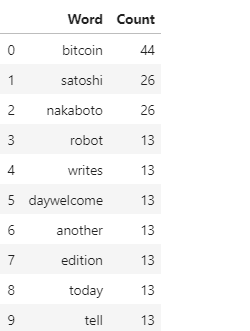
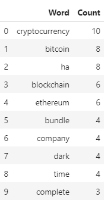
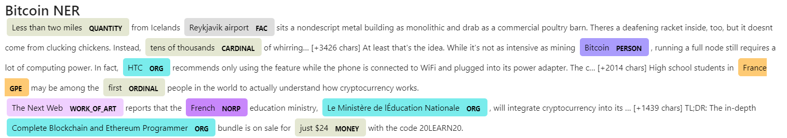
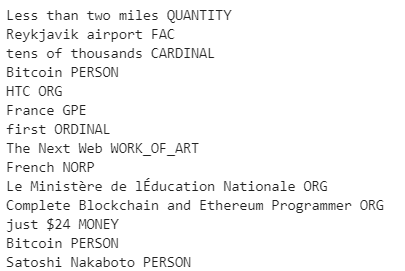

# Natural Language Processing Techniques

In this assignment, fundamental natural language processing techniques from the `Natural Language Tool Kit (NLTK)` library were applied to the latest news articles featuring Bitcoin and Ethereum. The news was pulled from the [newsapi](https://newsapi.org/), and a number of factors were analyzed; sentiment, common words, phrases, organizations, and entities mentioned in aticles.

1. [News Sentiment Analysis](#News-Sentiment-Analysis)
1. [Tokenizer](#Tokenizer)
2. [N-Grams and Frequency Analysis](#N-Grams-and-Frequency-Analysis)
1. [Word Clouds](#Word-Clouds)
3. [Named Entity Recognition](#Named-Entity-Recognition)

## News Sentiment Analysis

Sentiment analysis is a process to determine emotional tone within a text, providing insights into attitudes or opinions. For this analysis, `SentimentIntensityAnalyzer` was imported from NLTK.Sentiment.Vader library. 

The API key environment variable was read in and used to create a newsapi client that fetched the news articles with `.get_everything()` using key words Bitcoin and Ethereum. There were 4321 results returned for Bitcoin and 900 for Ethereum. The title and content were extracted from each result, with a limitation of 260 characters tuncated by newsapi for each article.  Sentiment scores were generated on the content applying `sentiment = analyzer.polarity_scores(text)` and `analyzer.polarity_scores()`. The sentiment scores, titles, and text were saved to DataFrames. 

 

The sentiment score results were summarized `.describe()`

<pre>
        Bitcoin Summary Sentiment Scores                  Ethereum Summary Sentiment Scores
</pre>
   

Bitcoin and Ethereum had similar mean positive scores, Bitcoin marginally higher. Bitcoin had the highest mean compound score, but Ethereum had the highest maximum compound score as well as the highest maximum positive score. Results overall were fairly similar with both showing low negative scores and sentiment primarily neutral. 

## Tokenizer

Tokenization is the process of segmenting text into words, sentences, or phrases to be used as inputs for further word or sentence processing. 

Before tokenization, the content of text was cleaned to remove punctuation, non-alphabet characters, and stop words. All words were reduced to lowercase and returned in root form, a process known as lemmatization.  Stopwords are common words that are present in the text but generally do not contribute to the meaning of a sentence. The `NLTK` package provides a pre-determined list of `stopwords`. Once the text was cleaned, the words in the content of each article were tokenized with `word_tokenize`.

<pre>
def tokenizer(text):
    """Tokenizes text."""
    sw = set(stopwords.words('english'))
    regex = re.compile("[^a-zA-Z ]")
    re_clean = regex.sub('', text)
    words = word_tokenize(re_clean)
    # Lemmatize Words into root words
    lemmatizer = WordNetLemmatizer() 
    lem = [lemmatizer.lemmatize(word) for word in words]
    #convert to lower and remove the stopwords 
    tokens = [word.lower() for word in lem if word.lower() not in sw.union(sw_addon)]
           
    return tokens
</pre> 

The title and content of each article were run through the tokenizer function and outputs were added to the DataFrames: 

## N-Grams and Frequency Analysis

N-Grams and Frequency analysis were performed at the word level. N-gram is a contiguous sequence of n items from a given sequence of text or speech. Frequency counts the number of times a word is used. Both are helpful in providing insight into words and phrases commonly associated with the text.  

In this analysis, `ngram` of size 2 was used from the `NLTK` library, and `Counter` to perform Frequency analysis from the `Collections` module. 

<pre>
        Bitcoin Top Bigram Results                  Ethereum Top Bigram Results
</pre>

            

Interestingly, Bitcoin was frequently used in Ethereum's articles.

<pre>
Bitcoin Top 10 Words             Ethereum Top 10 Words
</pre>

               

## Word Clouds

Word Clouds are used to visually represent text data, the size of each word indicates its frequency. A word cloud was generated for Bitcoin and Ethereum. 

## Named Entity Recognition

Named entity recognition locates and classifies named entities in the text into pre-defined categories, definitions below. 

A named entity recognition was generated for both coins and visualized using `displacy` from the `SpaCy` library. 

#### Reference
PERSON, NORP (nationalities, religious and political groups), FAC (buildings, airports etc.), ORG (organizations), GPE (countries, cities etc.), LOC (mountain ranges, water bodies etc.), PRODUCT (products), EVENT (event names), WORK_OF_ART (books, song titles), LAW (legal document titles), LANGUAGE (named languages), DATE, TIME, PERCENT, MONEY, QUANTITY, ORDINAL and CARDINAL

